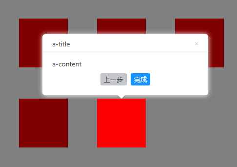

# 效果图



# React 中的使用示例

```tsx
import React, { useRef, useEffect } from 'react';
import { guide, close } from 'friendly-guide';

const STEP_ARR = [
  {
    el: 'a',
    position: 'top',
    showPrev: false,
    nextBtnText: '下一步，可自定义',
    nextBtnColor: 'red',
    explain: {
      title: 'a-title',
      content: 'a-content',
    },
  },
  {
    el: 'b',
    position: 'bottom',
    explain: {
      title: 'a-title',
      content: 'a-content',
    },
  },
  {
    el: 'c',
    position: 'right',
    explain: {
      title: 'a-title',
      content: 'a-content',
    },
  },
  {
    el: 'd',
    position: 'left',
    explain: {
      title: 'a-title',
      content: 'a-content',
    },
  },
  {
    el: 'e',
    position: 'top',
    nextBtnText: '完成',
    explain: {
      title: 'a-title',
      content: 'a-content',
    },
  },
];

const App = () => {
  const currentStep = useRef<number>(0);

  useEffect(() => {
    currentStep.current = 0;
  }, []);

  const reset = () => {
    currentStep.current = 0;
    close();
  };

  const guideFn = () => {
    const item = {
      maskClosable: false,
      onClickClose: () => {
        alert('关闭了');
        close();
      },
      onClickNext: () => {
        if (currentStep.current < STEP_ARR.length - 1) {
          currentStep.current = currentStep.current + 1;
          guideFn();
        } else {
          reset();
          return;
        }
      },
      onClickPrev: () => {
        if (currentStep.current > 0) {
          currentStep.current = currentStep.current - 1;
          guideFn();
        } else {
          reset();
          return;
        }
      },
    };

    const option = {
      ...STEP_ARR[currentStep.current],
      ...item,
    };

    console.log(option);

    guide(option);
  };
  const style = {
    width: 100,
    height: 100,
    background: 'red',
    margin: 30,
    display: 'inline-block',
  };
  return (
    <div className="App">
      <button onClick={guideFn}>button</button>

      <div
        style={{
          width: 500,
          margin: '100px auto',
        }}
      >
        <div id="a" style={style}></div>
        <div id="b" style={style}></div>
        <div id="c" style={style}></div>
        <div id="d" style={style}></div>
        <div id="e" style={style}></div>
      </div>
    </div>
  );
};

export default App;
```

#API

| 参数             | 说明                                 | 类型           | 默认值         | 是否必填              | 备注               |
| ---------------- | ------------------------------------ | -------------- | -------------- | --------------------- | ------------------ |
| el               | 需要引导的元素                       | 元素 id        | 无             | 是                    | -                  |
| classWarp        | 自定义样式覆盖原有样式               | String         | 无             | 否                    | -                  |
| position         | 方向                                 | String         | bottom         | top/left/right/bottom | -                  |
| onClickContainer | 点击容器的回调，点击任何地方都会触发 | Function       | 无             | 否                    |
| onClickNext      | 点击下一步触发                       | Function       | 无             | 否                    |
| onClickPrev      | 点击上一步触发                       | Function       | 无             | 否                    |
| onClickClose     | 关闭触发                             | Function       | 无             | 否                    |
| nextBtnColor     | 下一步的按钮颜色否                   | String         | #1890FF        | 否                    | -                  |
| prevBtnColor     | 上一步的按钮颜色                     | String         | #c4c6cc        | 否                    | -                  |
| nextBtnText      | 下一步按钮文字                       | String         | 下一步         | 否                    |
| prevBtnText      | 上一步按钮文字                       | String         | 上一步         | 否                    |
| showNext         | 是否显示下一步按钮                   | Boolean        | true           | 否                    |
| showPrev         | 是否显示上一步按钮                   | Boolean        | true           | 否                    |
| showClose        | 是否显示关闭按钮                     | Boolean        | true           | 否                    |
| maskClosable     | 点击蒙层是否允许关闭                 | Boolean        | true           | 否                    |
| explain          | 说明 modal                           | Object/Boolean | { width: 340 } | 否                    | false 的时候不显示 |

explain

| 参数    | 说明 | 类型   | 默认值         | 是否必填 | 备注 |
| ------- | ---- | ------ | -------------- | -------- | ---- |
| width   |      | Number | { width: 340 } | 否       |
| title   |      | String | 无             | 否       |
| content |      | String | 无             | 否       |

```

```
